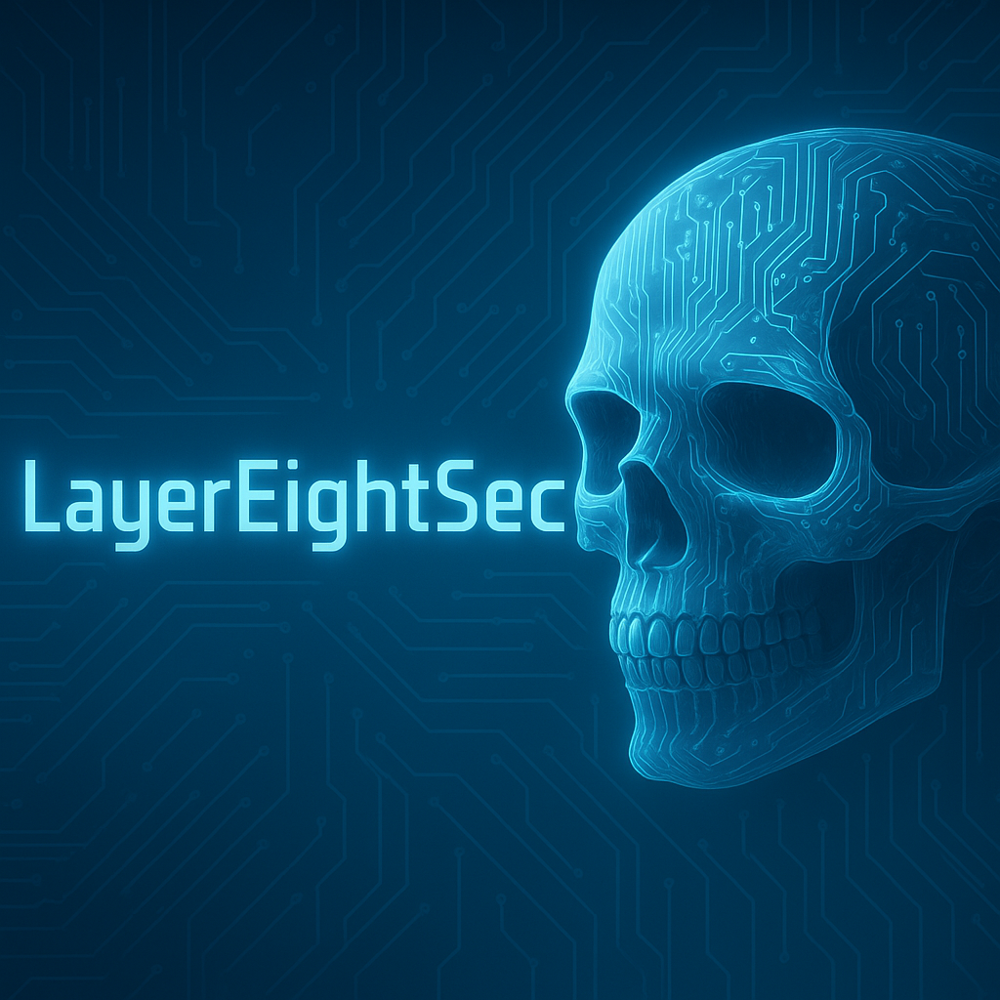
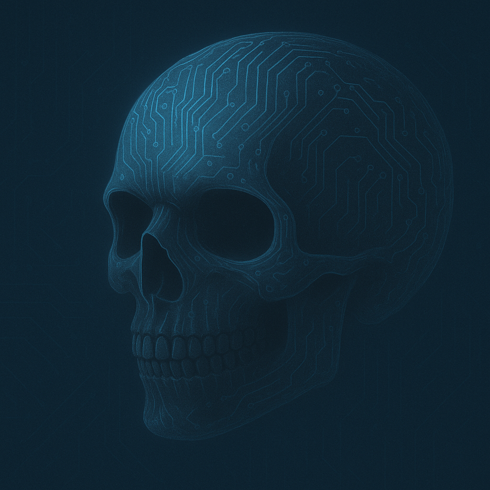

  

  

# Hi, I'm LayerEightSec

**Cybersecurity enthusiast focused on blue team ops, threat detection, and network defense. Practicing with Splunk, Wireshark, and hands-on labs. Layer 8 believer — because people are the first line of defense.**

---

### Tools & Technologies
- Splunk
- Wireshark
- Metasploit
- Sysmon
- VirtualBox
- Kali Linux
- Windows 10/11
- Linux (Ubuntu)

---

### Current Projects
- Building a home lab for Blue Team defense with Splunk and Sysmon
- Practicing threat detection with Wireshark packet captures
- Learning network fundamentals and log analysis

---

### Certifications
- CompTIA Security+ (2024)

---

### What I'm Learning
- Detection engineering & threat hunting
- SIEM tuning and alerting
- Networking and packet analysis
- Purple teaming techniques

---

### Connect With Me
*(Coming soon: portfolio site or resume link)*
